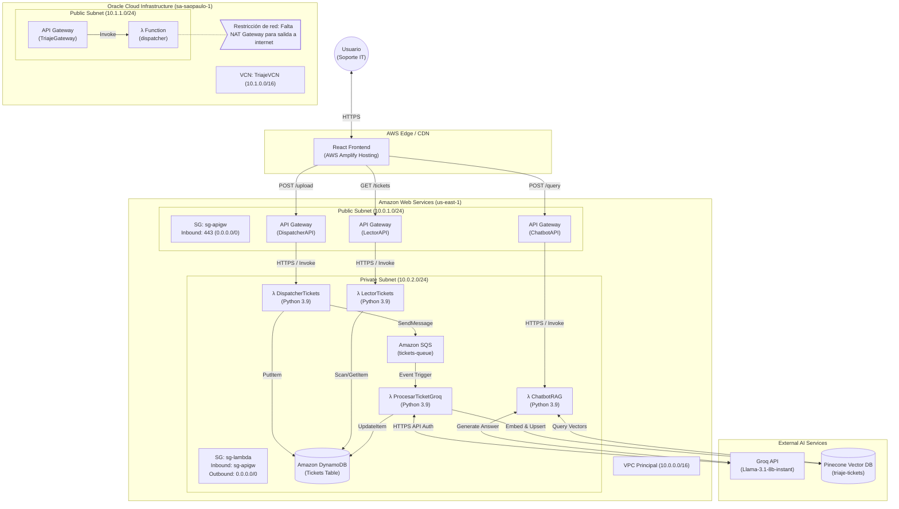

# Arquitectura del Sistema: Triaje-IT

El proyecto implementa una arquitectura multicloud orientada a eventos, serverless y con capacidades de Inteligencia Artificial (LLM + Vector DB) para automatizar el triaje y resolución de tickets de soporte técnico IT.

## Diagrama de Arquitectura Detallado

## Explicación del Flujo de Datos

### 1. Ingesta de Tickets (Dispatcher)
El React Frontend envía un archivo CSV parseado como JSON al DispatcherAPI (API Gateway HTTP). Esta petición invoca la Lambda `DispatcherTickets`. La función itera sobre cada ticket, lo guarda en DynamoDB con estado `PENDIENTE` e introduce un mensaje en la cola Amazon SQS para su procesamiento asíncrono.

### 2. Procesamiento Inteligente (AI)
El servicio SQS actúa como trigger e invoca automáticamente la Lambda `ProcesarTicketGroq`. 
- La función extrae el problema del usuario y se conecta a la API de Groq utilizando el LLM `Llama-3.1-8b-instant` para analizar el ticket, categorizarlo y proponer una solución técnica.
- Una vez procesado, actualiza el estado a `RESUELTO` en DynamoDB.
- Finalmente, se conecta a Pinecone Inference API para generar un Vector (Embedding) usando `multilingual-e5-large` y lo inserta en el índice Serverless de Pinecone para alimentar el motor RAG.

### 3. Motor RAG Conversacional (Chatbot)
El usuario puede interactuar con un Chatbot dentro del dashboard. 
Al hacer una pregunta, el frontend llama al ChatbotAPI. La Lambda `ChatbotRAG` genera un embedding de la pregunta, busca los 3 vectores (tickets) más similares matemáticamente en Pinecone, y le pasa estos tickets históricos a Llama 3.1 como Contexto. Llama 3.1 formula una respuesta amigable y certera basándose estrictamente en las resoluciones pasadas.

### 4. Seguridad y Red (AWS)
- Las 3 funciones Lambda orientadas al frontend están expuestas a través de API Gateways que manejan las peticiones preflight de CORS (`OPTIONS`).
- Toda la base de datos (DynamoDB) y el encolamiento (SQS) se ejecutan dentro del ecosistema gestionado de AWS con roles IAM restrictivos (`LabRole`).
- Oracle Cloud Infrastructure (OCI) se configuró como una opción de entrada multicloud, pero debido a restricciones de red (ausencia de un NAT Gateway para la Subred Pública configurada), la arquitectura principal recae enteramente en la infraestructura de AWS.
